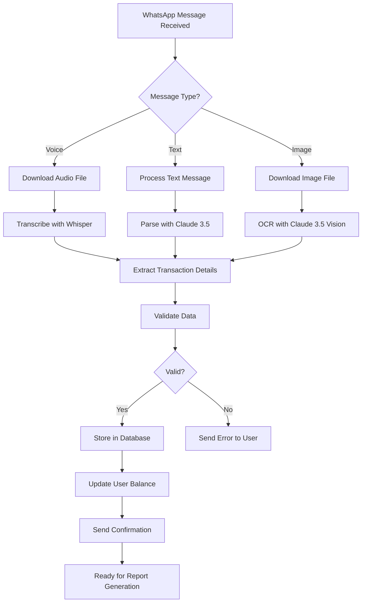

# AkoweAI - Technical Implementation Documentation

**Project:** AkoweAI - Multilingual AI Financial Bridge for Africa's Invisible MSMEs  
**Date:** April 2026  
**Status:** MVP Development Phase

---

## Table of Contents

1. [Project Overview](#project-overview)
2. [Backend Architecture](#backend-architecture)
3. [AI/ML Implementation](#aiml-implementation)
4. [Frontend Architecture](#frontend-architecture)
5. [System Integration](#system-integration)
6. [Deployment & DevOps](#deployment--devops)

---

## Project Overview

### High-Level Architecture Diagram

```
┌─────────────────────────────────────────────────────────────────┐
│                         WhatsApp Interface                       │
│                    (Twilio/WhatsApp Business API)                │
└────────────────────┬────────────────────────────────────────────┘
                     │
         ┌───────────┼───────────┐
         │           │           │
    Text Messages  Voice Notes  Images/Photos
         │           │           │
    ┌────▼───────────▼───────────▼────┐
    │    Backend API Gateway            │
    │    (Express.js/FastAPI)           │
    └────┬─────────────────────────────┘
         │
    ┌────┴─────────────────────────────────────┐
    │                                           │
    │  ┌──────────────────────────────────┐    │
    │  │  Message Processing Queue        │    │
    │  │  (Celery/Bull)                   │    │
    │  └──────────────────────────────────┘    │
    │                                            │
    │  ┌──────────────────────────────────┐    │
    │  │  Claude 3.5 Sonnet Integration   │    │
    │  │  (Multimodal AI Engine)          │    │
    │  └──────────────────────────────────┘    │
    │                                            │
    │  ┌──────────────────────────────────┐    │
    │  │  OpenAI Whisper (STT)            │    │
    │  │  (Audio Processing)              │    │
    │  └──────────────────────────────────┘    │
    │                                            │
    └────┬─────────────────────────────────────┘
         │
    ┌────▼─────────────────────────────┐
    │   PostgreSQL/Firebase Database    │
    │   (Transaction Storage, User Data)│
    └────┬─────────────────────────────┘
         │
    ┌────▼──────────────────────────────┐
    │  ReportLab (PDF Generation)       │
    │  (Credit-Ready Financial Reports) │
    └──────────────────────────────────┘
```

---

## Backend Architecture

### 1. Technology Stack

| Component          | Technology                | Purpose                                     |
| ------------------ | ------------------------- | ------------------------------------------- |
| **API Server**     | FastAPI / Express.js      | Handle WhatsApp webhooks, REST endpoints    |
| **Message Queue**  | Celery / Bull             | Asynchronous task processing                |
| **Database**       | PostgreSQL + Firebase     | Business data, user info, transactions      |
| **Cloud Storage**  | AWS S3 / Firebase Storage | Store images, audio files, generated PDFs   |
| **Authentication** | JWT + OAuth2              | Secure API access, WhatsApp verification    |
| **PDF Generation** | ReportLab / WeasyPrint    | Generate bank-standard financial statements |

### 2. API Endpoints

#### 2.1 WhatsApp Webhook Endpoints

```
POST /api/v1/webhooks/whatsapp
├── Receives messages from WhatsApp Business API
├── Validates webhook signature (Meta-provided token)
├── Routes to appropriate handler (text, voice, image)
└── Returns 200 OK immediately

GET /api/v1/webhooks/whatsapp
└── Webhook verification endpoint (required by WhatsApp)

POST /api/v1/messages/send
├── Send WhatsApp messages back to users
├── Payload: { phone, message, type }
└── Returns: { messageId, status }
```

#### 2.2 Transaction Management Endpoints

```
POST /api/v1/transactions
├── Create new transaction
├── Body: { userId, description, amount, category, timestamp }
└── Returns: { transactionId, createdAt }

GET /api/v1/transactions/:userId
├── Retrieve user's transaction history
├── Query params: { startDate, endDate, category }
└── Returns: Array of transactions

PUT /api/v1/transactions/:transactionId
├── Update transaction details
├── Body: { amount, category, description }
└── Returns: Updated transaction object

DELETE /api/v1/transactions/:transactionId
├── Soft delete transaction (archive)
└── Returns: { deletedAt, status }
```

#### 2.3 Reporting Endpoints

```
POST /api/v1/reports/generate
├── Generate bank-ready financial report
├── Body: { userId, reportType, startDate, endDate }
├── reportType: 'credit-ready', 'monthly', 'quarterly'
└── Returns: { reportId, pdfUrl, generatedAt }

GET /api/v1/reports/:reportId
├── Retrieve generated report
└── Returns: { reportData, pdfUrl, signature }

POST /api/v1/reports/:reportId/share
├── Share report with bank (with user consent)
├── Body: { bankId, expiration }
└── Returns: { shareToken, expiresAt }
```

#### 2.4 User Management Endpoints

```
POST /api/v1/auth/register
├── Register new MSME owner
├── Body: { phoneNumber, businessName, dialect }
└── Returns: { userId, token }

GET /api/v1/users/me
├── Get current user profile
└── Returns: User object

PUT /api/v1/users/:userId/preferences
├── Update language, notification settings
├── Body: { preferredLanguage, businessType }
└── Returns: Updated user object
```

### 3. Database Schema

#### 3.1 PostgreSQL Tables

```sql
-- Users Table
CREATE TABLE users (
  id UUID PRIMARY KEY,
  phone_number VARCHAR(20) UNIQUE NOT NULL,
  business_name VARCHAR(255),
  preferred_dialect VARCHAR(50), -- 'pidgin', 'yoruba', 'igbo', 'hausa'
  business_type VARCHAR(100),
  created_at TIMESTAMP DEFAULT NOW(),
  updated_at TIMESTAMP,
  is_active BOOLEAN DEFAULT TRUE
);

-- Transactions Table
CREATE TABLE transactions (
  id UUID PRIMARY KEY,
  user_id UUID REFERENCES users(id),
  amount DECIMAL(12, 2),
  currency VARCHAR(3) DEFAULT 'NGN',
  category VARCHAR(100), -- 'income', 'expense', 'debt'
  description TEXT,
  is_deleted BOOLEAN DEFAULT FALSE,
  created_at TIMESTAMP DEFAULT NOW(),
  updated_at TIMESTAMP,
  source VARCHAR(50) -- 'voice', 'image', 'text'
);

-- Images/Receipts Table
CREATE TABLE receipt_images (
  id UUID PRIMARY KEY,
  user_id UUID REFERENCES users(id),
  transaction_id UUID REFERENCES transactions(id),
  s3_key VARCHAR(255),
  extraction_data JSONB,
  extracted_at TIMESTAMP,
  created_at TIMESTAMP DEFAULT NOW()
);

-- Voice Messages Table
CREATE TABLE voice_messages (
  id UUID PRIMARY KEY,
  user_id UUID REFERENCES users(id),
  transaction_id UUID REFERENCES transactions(id),
  s3_audio_key VARCHAR(255),
  transcription TEXT,
  dialect_detected VARCHAR(50),
  transcribed_at TIMESTAMP,
  created_at TIMESTAMP DEFAULT NOW()
);

-- Reports Table
CREATE TABLE reports (
  id UUID PRIMARY KEY,
  user_id UUID REFERENCES users(id),
  report_type VARCHAR(50), -- 'credit-ready', 'monthly', 'quarterly'
  pdf_s3_key VARCHAR(255),
  summary JSONB, -- income, expenses, net profit, debts
  generated_at TIMESTAMP,
  created_at TIMESTAMP DEFAULT NOW()
);

-- Report Sharing Table
CREATE TABLE report_shares (
  id UUID PRIMARY KEY,
  report_id UUID REFERENCES reports(id),
  bank_id VARCHAR(100),
  share_token VARCHAR(255) UNIQUE,
  accessed_count INT DEFAULT 0,
  expires_at TIMESTAMP,
  created_at TIMESTAMP DEFAULT NOW()
);

-- AI Processing Jobs Table
CREATE TABLE ai_jobs (
  id UUID PRIMARY KEY,
  user_id UUID REFERENCES users(id),
  job_type VARCHAR(50), -- 'transcription', 'ocr', 'analysis'
  input_data JSONB,
  output_data JSONB,
  status VARCHAR(50) DEFAULT 'pending', -- 'pending', 'processing', 'completed', 'failed'
  error_message TEXT,
  created_at TIMESTAMP DEFAULT NOW(),
  completed_at TIMESTAMP
);
```

### 4. Message Processing Flow



### 5. Error Handling & Logging

```javascript
// Centralized Error Handling
class AppError extends Error {
    constructor(statusCode, message) {
        super(message);
        this.statusCode = statusCode;
        this.timestamp = new Date();
    }
}

// Logger Configuration
const logger = {
    error: (context, error) => console.error(`[ERROR] ${context}:`, error),
    warn: (context, msg) => console.warn(`[WARN] ${context}:`, msg),
    info: (context, msg) => console.info(`[INFO] ${context}:`, msg),
    debug: (context, msg) => console.debug(`[DEBUG] ${context}:`, msg),
};

// Middleware for Error Handling
app.use((err, req, res, next) => {
    logger.error("Request Error", err);
    res.status(err.statusCode || 500).json({
        error: err.message,
        timestamp: new Date(),
        requestId: req.id,
    });
});
```

---

## AI/ML Implementation

### 1. Claude 3.5 Sonnet Integration

#### 1.1 Core Components

```python
import anthropic
import json
from typing import Dict, Any

class AkoweAIEngine:
    def __init__(self):
        self.client = anthropic.Anthropic()
        self.model = "claude-3-5-sonnet-20241022"
        self.max_tokens = 2000

    def process_voice_transcription(self, text: str, dialect: str) -> Dict[str, Any]:
        """
        Process transcribed voice note and extract transaction details
        Supports: Pidgin, Yoruba, Igbo, Hausa
        """
        prompt = f"""
You are a financial data extraction AI for Nigerian informal traders.

Transcribed text (in {dialect}):
"{text}"

Extract the following transaction details:
1. Amount (in NGN)
2. Transaction type (income, expense, debt)
3. Category (e.g., fuel, inventory, sales, equipment)
4. Items mentioned (if any)
5. Counterparty (creditor/debtor name if mentioned)

Respond in valid JSON format only:
{{
  "amount": <number>,
  "type": "<income|expense|debt>",
  "category": "<category>",
  "items": [<list of items>],
  "counterparty": "<name or null>",
  "confidence": <0-1>,
  "raw_text": "{text}"
}}
"""
        response = self.client.messages.create(
            model=self.model,
            max_tokens=self.max_tokens,
            messages=[
                {"role": "user", "content": prompt}
            ]
        )

        return json.loads(response.content[0].text)

    def process_receipt_image(self, image_data: bytes) -> Dict[str, Any]:
        """
        Process image of handwritten/printed receipt using vision
        """
        import base64

        base64_image = base64.standard_b64encode(image_data).decode('utf-8')

        prompt = """
You are analyzing a Nigerian business receipt/invoice image.

Extract ALL the following details:
1. Items purchased/sold (with quantities and unit prices)
2. Total amount
3. Date (if visible)
4. Seller/buyer information
5. Any payments made or amounts due
6. Categories for each line item

Respond in valid JSON:
{
  "items": [
    {"description": "<item>", "quantity": <num>, "unit_price": <num>, "total": <num>}
  ],
  "total_amount": <number>,
  "date": "<date or null>",
  "seller_info": "<info>",
  "buyer_info": "<info>",
  "amount_due": <number or null>,
  "confidence": <0-1>,
  "notes": "<any additional notes>"
}
"""
        response = self.client.messages.create(
            model=self.model,
            max_tokens=self.max_tokens,
            messages=[
                {
                    "role": "user",
                    "content": [
                        {"type": "text", "text": prompt},
                        {
                            "type": "image",
                            "source": {
                                "type": "base64",
                                "media_type": "image/jpeg",
                                "data": base64_image
                            }
                        }
                    ]
                }
            ]
        )

        return json.loads(response.content[0].text)

    def generate_business_insights(self, transactions: list) -> Dict[str, Any]:
        """
        Analyze transaction history and provide business insights
        Uses 200k context window for comprehensive analysis
        """
        transactions_text = json.dumps(transactions, indent=2)

        prompt = f"""
You are a business analyst for Nigerian MSMEs. Analyze this transaction data and provide:

1. Total Income (last 30, 90, 180 days)
2. Total Expenses breakdown by category
3. Profitability metrics
4. Cash flow patterns
5. Peak sales periods
6. Spending patterns
7. Debt status
8. Recommendations for growth

Transaction History:
{transactions_text}

Respond in JSON format:
{{
  "total_income_30d": <number>,
  "total_income_90d": <number>,
  "total_expenses": <number>,
  "net_profit": <number>,
  "expense_breakdown": {{}},
  "cash_flow_stability": "<stable|volatile>",
  "peak_sales_period": "<period>",
  "debts_owed": <number>,
  "recommendations": [<list of actionable recommendations>],
  "credit_readiness_score": <0-100>
}}
"""
        response = self.client.messages.create(
            model=self.model,
            max_tokens=self.max_tokens,
            messages=[
                {"role": "user", "content": prompt}
            ]
        )

        return json.loads(response.content[0].text)
```

#### 1.2 Configuration & Best Practices

```python
# Prompt Engineering Best Practices

SYSTEM_PROMPTS = {
    "transaction_extraction": """You are a financial data extraction specialist for African MSMEs.
Your task is to accurately extract structured financial information from unstructured data.
Always respond with valid JSON. If data is unclear, set confidence < 0.5.
Currency is NGN unless otherwise specified.""",

    "nlp_intent": """Understand the user's intent from their message or voice note.
Intents: create_transaction, view_balance, generate_report, set_reminder, ask_help.
Always classify intent with confidence score.""",

    "dialect_mapper": """Map informal/dialectal Nigerian phrases to formal business categories.
Examples:
- 'I don buy diesel for 50k' -> Type: expense, Category: fuel
- 'Na him buy my goods for 200k' -> Type: income, Category: sales
- 'I don debt am 30k' -> Type: debt, Category: credit_given"""
}

# Error Handling for Claude API
MAX_RETRIES = 3
TIMEOUT = 30

def call_claude_with_retry(prompt, max_retries=MAX_RETRIES):
    """Resilient Claude API calls with exponential backoff"""
    import time
    for attempt in range(max_retries):
        try:
            response = client.messages.create(
                model="claude-3-5-sonnet-20241022",
                max_tokens=2000,
                messages=[{"role": "user", "content": prompt}]
            )
            return response
        except Exception as e:
            if attempt == max_retries - 1:
                raise
            wait_time = 2 ** attempt
            logger.warn(f"Claude API call failed, retrying in {wait_time}s", str(e))
            time.sleep(wait_time)
```

### 2. Audio Processing with OpenAI Whisper

```python
import openai

class AudioProcessor:
    def __init__(self):
        self.client = openai.OpenAI()

    def transcribe_voice_note(self, audio_file_path: str) -> Dict[str, Any]:
        """
        Transcribe voice note in local dialect
        Supports: Pidgin, Yoruba, Igbo, Hausa
        """
        with open(audio_file_path, 'rb') as audio:
            transcript = self.client.audio.transcriptions.create(
                model="whisper-1",
                file=audio,
                language="yo"  # Auto-detect or specify language code
            )

        return {
            "text": transcript.text,
            "language": "pidgin/yoruba/igbo/hausa",
            "duration": transcript.get("duration")
        }

    def detect_language(self, audio_file_path: str) -> str:
        """Detect the language/dialect of the audio"""
        # Use Whisper's language detection or separate model
        pass
```

### 3. RAG (Retrieval Augmented Generation)

```python
from langchain.vectorstores import Pinecone
from langchain.embeddings import OpenAIEmbeddings
from langchain.chains import RetrievalQA

class RAGSystem:
    def __init__(self):
        self.embeddings = OpenAIEmbeddings()
        # Initialize Pinecone for vector storage
        self.vector_store = Pinecone.from_documents(
            documents=[],
            embedding=self.embeddings,
            index_name="akowe-business-context"
        )

    def store_transaction_history(self, user_id: str, transactions: list):
        """
        Store transaction history as vectors for RAG
        """
        documents = [
            f"Date: {t['date']}, Amount: {t['amount']}, Category: {t['category']}, Note: {t['description']}"
            for t in transactions
        ]
        self.vector_store.add_texts(documents, metadatas=[{"user_id": user_id} for _ in documents])

    def retrieve_context(self, user_id: str, query: str) -> str:
        """
        Retrieve relevant transaction history for context
        Example: "Your sales in March" - retrieves March transactions
        """
        docs = self.vector_store.similarity_search(
            query, k=5,
            filter={"user_id": user_id}
        )
        return "\n".join([doc.page_content for doc in docs])
```

---

## Frontend Architecture

### 1. Landing Page (Static/Simple)

#### 1.1 Technology Stack

| Component      | Technology                              |
| -------------- | --------------------------------------- |
| **Framework**  | React.js / Next.js (or simple HTML/CSS) |
| **Styling**    | Tailwind CSS                            |
| **Deployment** | Vercel / Firebase Hosting / Netlify     |
| **Analytics**  | Google Analytics, Mixpanel              |

#### 1.2 Landing Page Structure

```
┌─────────────────────────────────────────┐
│         AkoweAI Landing Page            │
├─────────────────────────────────────────┤
│                                         │
│  Header: Logo + Nav Menu                │
│  - Home                                 │
│  - About                                │
│  - Features                             │
│  - Contact                              │
│                                         │
├─────────────────────────────────────────┤
│                                         │
│  Hero Section:                          │
│  - Headline: "Your AI Business Co-Pilot"│
│  - Subheader: "Speak. We record. We analyze."
│  - CTA Button: "Get Started on WhatsApp"│
│                                         │
├─────────────────────────────────────────┤
│                                         │
│  Features Section (3 Cards):           │
│  1. 🎤 Voice-First Interface           │
│  2. 🖼️  Receipt Recognition            │
│  3. 📊 Instant Reports                 │
│                                         │
├─────────────────────────────────────────┤
│                                         │
│  How It Works:                          │
│  - Screenshots of WhatsApp             │
│  - Step-by-step flow                   │
│                                         │
├─────────────────────────────────────────┤
│                                         │
│  Benefits Section:                      │
│  - For Traders                          │
│  - For Banks                            │
│  - For Microfinance                     │
│                                         │
├─────────────────────────────────────────┤
│                                         │
│  CTA: "Join 100+ Traders Using AkoweAI"│
│  - WhatsApp Icon                        │
│  - Phone Number: +234...                │
│                                         │
├─────────────────────────────────────────┤
│         Footer + Contact Info           │
└─────────────────────────────────────────┘
```

#### 1.3 Landing Page Code Example (React)

```jsx
// components/Hero.jsx
import React from 'react';

export default function Hero() {
  const handleWhatsAppClick = () => {
    const phoneNumber = '234XXXXXXXXXX'; // Nigeria country code
    const message = encodeURIComponent('Hi AkoweAI, I want to start managing my business');
    window.open(`https://wa.me/${phoneNumber}?text=${message}`, '_blank');
  };

  return (
    <div className="hero bg-gradient-to-r from-blue-600 to-green-600 text-white py-20">
      <div className="container mx-auto text-center">
        <h1 className="text-5xl font-bold mb-4">Your AI Business Co-Pilot</h1>
        <p className="text-xl mb-8">Speak your dialect. We handle the accounting.</p>

        <button
          onClick={handleWhatsAppClick}
          className="bg-green-500 hover:bg-green-600 text-white font-bold py-3 px-8 rounded-lg flex items-center justify-center mx-auto"
        >
          <svg className="w-6 h-6 mr-2" fill="currentColor" viewBox="0 0 24 24">
            {/* WhatsApp Icon SVG */}
          </svg>
          Get Started on WhatsApp
        </button>
      </div>
    </div>
  );
}

// pages/index.jsx
import Hero from '../components/Hero';
import Features from '../components/Features';
import HowItWorks from '../components/HowItWorks';

export default function HomePage() {
  return (
    <main>
      <Hero />
      <Features />
      <HowItWorks />
    </main>
  );
}
```

#### 1.4 WhatsApp Redirect Implementation

```jsx
// components/WhatsAppButton.jsx
export function WhatsAppButton({ phoneNumber, message, label }) {
    const handleClick = () => {
        // Format: https://wa.me/[country code][phone number]
        const formattedPhone = phoneNumber.replace(/\D/g, "");
        const encodedMessage = encodeURIComponent(message);
        const whatsappUrl = `https://wa.me/${formattedPhone}?text=${encodedMessage}`;
        window.open(whatsappUrl, "_blank");
    };

    return (
        <button
            onClick={handleClick}
            className="whatsapp-btn green-bg text-white font-bold py-2 px-6 rounded"
        >
            {label || "💬 Chat on WhatsApp"}
        </button>
    );
}

// Usage
<WhatsAppButton
    phoneNumber="+234 (XXX) XXXX-XXXX"
    message="Hi AkoweAI, I want to start managing my business today!"
    label="Start Your Free Trial"
/>;
```

### 2. Mobile-First Responsive Design

```css
/* styles/responsive.css */

/* Mobile First Approach */
@media (max-width: 640px) {
    body {
        font-size: 14px;
    }

    .hero {
        padding: 40px 20px;
    }

    .hero h1 {
        font-size: 28px;
    }

    .container {
        padding: 0 15px;
    }
}

/* Tablet */
@media (min-width: 641px) and (max-width: 1024px) {
    .container {
        max-width: 640px;
    }
}

/* Desktop */
@media (min-width: 1025px) {
    .container {
        max-width: 1200px;
    }
}
```

### 3. Landing Page Analytics

```jsx
// utils/analytics.js
import { useEffect } from "react";

export function trackEvent(category, action, label) {
    if (typeof window !== "undefined" && window.gtag) {
        window.gtag("event", action, {
            event_category: category,
            event_label: label,
        });
    }
}

// Track WhatsApp button clicks
export function trackWhatsAppClick() {
    trackEvent("engagement", "whatsapp_click", "cta_button");
}

// Measure landing page performance
export function usePageMetrics() {
    useEffect(() => {
        if (typeof window !== "undefined" && window.performance) {
            const perfData = window.performance.timing;
            const pageLoadTime =
                perfData.loadEventEnd - perfData.navigationStart;
            trackEvent("performance", "page_load", pageLoadTime);
        }
    }, []);
}
```

---

## System Integration

### 1. WhatsApp Business API Integration

```python
# whatsapp_integration.py
import requests
import json
from typing import Dict, Any

class WhatsAppManager:
    def __init__(self, business_account_id: str, access_token: str):
        self.business_account_id = business_account_id
        self.access_token = access_token
        self.api_version = "v18.0"
        self.base_url = f"https://graph.instagram.com/{self.api_version}"

    def send_message(self, phone_number: str, message_text: str) -> Dict[str, Any]:
        """Send text message via WhatsApp"""
        url = f"{self.base_url}/{self.business_account_id}/messages"

        payload = {
            "messaging_product": "whatsapp",
            "recipient_type": "individual",
            "to": phone_number,
            "type": "text",
            "text": {"body": message_text}
        }

        headers = {
            "Authorization": f"Bearer {self.access_token}",
            "Content-Type": "application/json"
        }

        response = requests.post(url, json=payload, headers=headers)
        return response.json()

    def send_file(self, phone_number: str, media_url: str, media_type: str) -> Dict[str, Any]:
        """Send document/image via WhatsApp"""
        url = f"{self.base_url}/{self.business_account_id}/messages"

        payload = {
            "messaging_product": "whatsapp",
            "to": phone_number,
            "type": media_type,  # 'document', 'image', 'audio'
            media_type: {
                "link": media_url,
                "caption": "Your AkoweAI Report"
            }
        }

        headers = {
            "Authorization": f"Bearer {self.access_token}",
            "Content-Type": "application/json"
        }

        response = requests.post(url, json=payload, headers=headers)
        return response.json()

    def handle_webhook(self, request_body: Dict) -> None:
        """Handle incoming WhatsApp webhook messages"""
        if request_body.get("object") != "whatsapp_business_account":
            return

        for entry in request_body.get("entry", []):
            for change in entry.get("changes", []):
                value = change.get("value", {})

                # Handle messages
                for message in value.get("messages", []):
                    self._process_message(message)

                # Handle status updates
                for status in value.get("statuses", []):
                    self._process_status(status)

    def _process_message(self, message: Dict) -> None:
        """Process incoming message from WhatsApp"""
        from_phone = message.get("from")
        message_type = message.get("type")

        if message_type == "text":
            text_content = message["text"]["body"]
            print(f"Text from {from_phone}: {text_content}")
            # Queue for Claude processing

        elif message_type == "audio":
            audio_id = message["audio"]["id"]
            print(f"Audio from {from_phone}: {audio_id}")
            # Download and queue for Whisper

        elif message_type == "image":
            image_id = message["image"]["id"]
            print(f"Image from {from_phone}: {image_id}")
            # Download and queue for Vision AI

    def _process_status(self, status: Dict) -> None:
        """Process message delivery status"""
        recipient_id = status.get("recipient_id")
        status_type = status.get("status")
        print(f"Message status for {recipient_id}: {status_type}")
```

### 2. Payment Integration (Banks & Microfinance)

```python
# banking_integration.py
class BankingIntegration:
    """Integration with Nigerian banks for credit report sharing"""

    def __init__(self):
        self.banks = {
            'gtb': {'code': '058', 'api_endpoint': 'https://api.gtb.ng'},
            'access': {'code': '044', 'api_endpoint': 'https://api.access.ng'},
            # Add more banks
        }

    def generate_credit_ready_report(self, user_id: str, months: int = 6) -> Dict[str, Any]:
        """
        Generate bank-standard financial report

        Report includes:
        - Trading history (transaction breakdown)
        - Income/expense analysis
        - Debt obligation tracking
        - Business stability metrics
        - Credit score estimate
        """
        report_data = {
            "user_id": user_id,
            "generated_date": datetime.now(),
            "report_period_months": months,
            "sections": {
                "business_summary": self._get_business_summary(user_id),
                "income_analysis": self._get_income_analysis(user_id, months),
                "expense_breakdown": self._get_expense_breakdown(user_id, months),
                "debt_status": self._get_debt_status(user_id),
                "cash_flow_pattern": self._get_cash_flow_pattern(user_id, months),
                "credit_worthiness_score": self._calculate_credit_score(user_id),
            }
        }
        return report_data

    def share_report_with_bank(self, user_id: str, report_id: str, bank_code: str) -> Dict[str, Any]:
        """
        Share report with bank (with user consent)
        Returns shareable token and access information
        """
        share_token = self._generate_secure_token()
        share_record = {
            "report_id": report_id,
            "bank_code": bank_code,
            "share_token": share_token,
            "shared_at": datetime.now(),
            "expires_at": datetime.now() + timedelta(days=30),
            "access_count": 0
        }
        # Store in database
        return share_record
```

---

## Deployment & DevOps

### 1. Architecture Deployment

#### 1.1 Backend Deployment (AWS/GCP)

```yaml
# docker-compose.yml for local development
version: "3.8"

services:
    api:
        build: ./backend
        ports:
            - "8000:8000"
        environment:
            - DATABASE_URL=postgresql://user:password@db:5432/akowe
            - REDIS_URL=redis://redis:6379
            - CLAUDE_API_KEY=${CLAUDE_API_KEY}
            - OPENAI_API_KEY=${OPENAI_API_KEY}
        depends_on:
            - db
            - redis

    db:
        image: postgres:15
        environment:
            - POSTGRES_USER=user
            - POSTGRES_PASSWORD=password
            - POSTGRES_DB=akowe
        volumes:
            - postgres_data:/var/lib/postgresql/data
        ports:
            - "5432:5432"

    redis:
        image: redis:7
        ports:
            - "6379:6379"

    worker:
        build: ./backend
        command: celery -A app.celery worker -l info
        environment:
            - DATABASE_URL=postgresql://user:password@db:5432/akowe
            - REDIS_URL=redis://redis:6379
        depends_on:
            - db
            - redis

    frontend:
        build: ./frontend
        ports:
            - "3000:3000"

volumes:
    postgres_data:
```

#### 1.2 Kubernetes Deployment (Production)

```yaml
# k8s/deployment.yaml
apiVersion: apps/v1
kind: Deployment
metadata:
    name: akowe-backend
spec:
    replicas: 3
    selector:
        matchLabels:
            app: akowe-backend
    template:
        metadata:
            labels:
                app: akowe-backend
        spec:
            containers:
                - name: api
                  image: akowe-backend:latest
                  ports:
                      - containerPort: 8000
                  env:
                      - name: DATABASE_URL
                        valueFrom:
                            secretKeyRef:
                                name: akowe-secrets
                                key: database-url
                      - name: CLAUDE_API_KEY
                        valueFrom:
                            secretKeyRef:
                                name: akowe-secrets
                                key: claude-api-key
                  resources:
                      limits:
                          cpu: "1"
                          memory: "512Mi"
                      requests:
                          cpu: "500m"
                          memory: "256Mi"
                  livenessProbe:
                      httpGet:
                          path: /health
                          port: 8000
                      initialDelaySeconds: 30
                      periodSeconds: 10
---
apiVersion: v1
kind: Service
metadata:
    name: akowe-backend-service
spec:
    selector:
        app: akowe-backend
    ports:
        - protocol: TCP
          port: 80
          targetPort: 8000
    type: LoadBalancer
```

### 2. CI/CD Pipeline

```yaml
# .github/workflows/deploy.yml
name: Deploy AkoweAI

on:
    push:
        branches: [main, develop]
    pull_request:
        branches: [main]

jobs:
    test:
        runs-on: ubuntu-latest
        steps:
            - uses: actions/checkout@v2

            - name: Set up Python
              uses: actions/setup-python@v2
              with:
                  python-version: 3.9

            - name: Install dependencies
              run: |
                  pip install -r requirements.txt

            - name: Run tests
              run: |
                  pytest tests/

            - name: Lint
              run: |
                  flake8 app/

    build:
        needs: test
        runs-on: ubuntu-latest
        steps:
            - uses: actions/checkout@v2

            - name: Build Docker image
              run: |
                  docker build -t akowe-backend:${{ github.sha }} .

            - name: Push to registry
              run: |
                  docker tag akowe-backend:${{ github.sha }} akowe-backend:latest
                  # Push to AWS ECR or Docker Hub

    deploy:
        needs: build
        runs-on: ubuntu-latest
        if: github.ref == 'refs/heads/main'
        steps:
            - name: Deploy to Kubernetes
              run: |
                  kubectl set image deployment/akowe-backend akowe-backend=akowe-backend:${{ github.sha }}
```

### 3. Monitoring & Logging

```python
# monitoring/metrics.py
from prometheus_client import Counter, Histogram, Gauge
import logging

# Define custom metrics
message_processing_time = Histogram(
    'message_processing_seconds',
    'Time spent processing messages',
    buckets=[0.5, 1, 2, 5, 10]
)

api_request_count = Counter(
    'api_requests_total',
    'Total API requests',
    ['method', 'endpoint', 'status']
)

active_users = Gauge(
    'active_users',
    'Number of active users'
)

claude_api_calls = Counter(
    'claude_api_calls',
    'Total Claude API calls',
    ['operation_type']
)

# Logger configuration
logging.basicConfig(
    level=logging.INFO,
    format='%(asctime)s - %(name)s - %(levelname)s - %(message)s',
    handlers=[
        logging.FileHandler('logs/akowe.log'),
        logging.StreamHandler()
    ]
)

logger = logging.getLogger(__name__)
```

---

## Security Considerations

### 1. Data Protection

```python
# security/encryption.py
from cryptography.fernet import Fernet
import os

class DataEncryption:
    def __init__(self):
        self.cipher_suite = Fernet(os.getenv('ENCRYPTION_KEY'))

    def encrypt_sensitive_data(self, data: str) -> str:
        """Encrypt sensitive financial data"""
        return self.cipher_suite.encrypt(data.encode()).decode()

    def decrypt_sensitive_data(self, encrypted_data: str) -> str:
        """Decrypt sensitive financial data"""
        return self.cipher_suite.decrypt(encrypted_data.encode()).decode()
```

### 2. API Authentication

```python
# security/auth.py
from fastapi import HTTPException, Depends
from fastapi.security import HTTPBearer, HTTPAuthCredentials
import jwt

security = HTTPBearer()

async def verify_token(credentials: HTTPAuthCredentials = Depends(security)):
    try:
        payload = jwt.decode(
            credentials.credentials,
            os.getenv('JWT_SECRET'),
            algorithms=['HS256']
        )
        return payload
    except jwt.InvalidTokenError:
        raise HTTPException(status_code=401, detail="Invalid token")
```

### 3. Compliance

-   **Data Privacy:** GDPR-compliant, user data deletion on request
-   **Financial Compliance:** CBN (Central Bank of Nigeria) regulations
-   **WhatsApp Terms:** Comply with WhatsApp Business API ToS
-   **PII Handling:** All personal data encrypted and properly stored

---

## Performance Optimization

### 1. Caching Strategy

```python
from redis import Redis

class CacheManager:
    def __init__(self):
        self.redis = Redis(host='localhost', port=6379, db=0)

    def cache_user_transactions(self, user_id: str, transactions: list, ttl: int = 3600):
        """Cache user transactions for faster retrieval"""
        self.redis.setex(
            f"transactions:{user_id}",
            ttl,
            json.dumps(transactions)
        )

    def get_cached_transactions(self, user_id: str):
        """Retrieve cached transactions"""
        cached = self.redis.get(f"transactions:{user_id}")
        return json.loads(cached) if cached else None
```

### 2. Database Optimization

```sql
-- Create indexes for faster queries
CREATE INDEX idx_user_transactions ON transactions(user_id, created_at DESC);
CREATE INDEX idx_transaction_category ON transactions(category, created_at);
CREATE INDEX idx_report_user ON reports(user_id, created_at DESC);
```

---

## Testing Strategy

### 1. Backend Tests

```python
# tests/test_transaction_processing.py
import pytest
from app.processors import TransactionProcessor

@pytest.fixture
def processor():
    return TransactionProcessor()

def test_voice_transcription_extraction(processor):
    """Test voice note processing"""
    voice_text = "I don buy diesel for 50 thousand naira"
    result = processor.extract_from_voice(voice_text, dialect="pidgin")

    assert result['amount'] == 50000
    assert result['category'] == 'fuel'
    assert result['type'] == 'expense'

def test_receipt_ocr(processor):
    """Test receipt image processing"""
    # Mock image processing
    result = processor.extract_from_image('test_receipt.jpg')

    assert 'items' in result
    assert 'total_amount' in result
    assert result['confidence'] > 0.8
```

### 2. API Integration Tests

```python
# tests/test_api_endpoints.py
def test_create_transaction():
    """Test transaction creation endpoint"""
    payload = {
        "description": "Sold goods",
        "amount": 100000,
        "category": "sales"
    }
    response = client.post("/api/v1/transactions", json=payload)
    assert response.status_code == 201

def test_generate_report():
    """Test report generation"""
    response = client.post("/api/v1/reports/generate", json={
        "report_type": "credit-ready",
        "days": 180
    })
    assert response.status_code == 200
    assert 'pdfUrl' in response.json()
```

---

## Getting Started Development Guide

### Backend Setup

```bash
# Clone repository
git clone https://github.com/yourorg/akowe-ai.git
cd akowe-ai/backend

# Create virtual environment
python -m venv venv
source venv/bin/activate  # On Windows: venv\Scripts\activate

# Install dependencies
pip install -r requirements.txt

# Set environment variables
cp .env.example .env
# Edit .env with your API keys

# Run database migrations
alembic upgrade head

# Start development server
uvicorn main:app --reload
```

### Frontend Setup

```bash
cd akowe-ai/frontend

# Install dependencies
npm install

# Create .env file
cp .env.example .env.local

# Start development server
npm run dev

# Build for production
npm run build
```

---

## Summary

AkoweAI is a comprehensive AI-driven financial management system tailored for Nigerian informal traders. The architecture leverages:

-   **Backend:** FastAPI/Express with PostgreSQL and Redis
-   **AI:** Claude 3.5 Sonnet for multimodal processing + OpenAI Whisper for transcription
-   **Frontend:** Simple React landing page with WhatsApp integration
-   **Integration:** WhatsApp Business API for user communication
-   **Deployment:** Docker, Kubernetes, and CI/CD pipelines

This technical implementation provides a scalable, secure, and user-friendly solution for financial inclusion in Africa.
